# 🚀 Documentación de Arquitectura y Buenas Prácticas de QA

> **Proyecto:** Net8PlaywrightQA  
> **Stack:** .NET 8 (C#) + Playwright C# + NUnit + Allure Report + GitHub Actions  
> **Nivel:** Enterprise / QA Automation Senior Standards  

---

## 📋 1. Ficha Técnica y Stack Tecnológico

| Componente | Tecnología | Versión | Rol en la Arquitectura |
| :--- | :--- | :--- | :--- |
| **Runtime & Lenguaje** | C# / .NET 8 SDK | `8.0.x` | Entorno de ejecución fuertemente tipado de alto rendimiento. |
| **Motor de Automatización** | Microsoft Playwright C# | `1.45.0` | Control de navegadores sin interfaz, auto-esperas y multimedia nativo. |
| **Framework de Pruebas** | NUnit | `4.1.0` | Runner de pruebas y control del ciclo de vida (`SetUp`/`TearDown`). |
| **Reporting Ejecutivo** | Allure NUnit + CLI | `2.12.1` | Dashboard HTML interactivo con métricas, severidades y evidencias. |
| **Integración Continua (CI)** | GitHub Actions (`pr-qa-validation.yml`) | v4 | Validar Pull Requests en paralelo (Chromium + Firefox) en ~35s. |
| **Despliegue Continuo (CD)** | GitHub Actions (`publish-allure-pages.yml`) | v4 | Publicar automáticamente el reporte web en GitHub Pages tras el merge. |
| **Notificaciones** | SMTP Email (`action-send-mail`) | v3 | Alertas automáticas por correo electrónico al finalizar las pruebas. |

---

## 🛠️ 2. Justificación Técnica de la Arquitectura

### 1. Microsoft Playwright C#
* **Auto-Waiting:** Esperas automáticas nativas que eliminan las pruebas inestables (*flaky tests*).
* **Grabación Nativa WebM:** Graba video directamente desde el motor de Chromium sin depender de software de terceros.
* **Aislamiento de Sesiones:** Cada prueba se ejecuta en un `BrowserContext` nuevo e independiente.

### 2. Patrón Page Object Model (POM)
* **Separación de Responsabilidades:**  
  * **[`Pages/LoginPage.cs`](file:///D:/Escritorio/pruebas/gitaction/Pages/LoginPage.cs):** Encapsula los localizadores de la interfaz y métodos de interacción.
  * **[`Tests/LoginE2ETests.cs`](file:///D:/Escritorio/pruebas/gitaction/Tests/LoginE2ETests.cs):** Contiene las especificaciones de prueba y aserciones (`Expect`/`Assert`).

### 3. Allure Reporting & Multimedia
* Clasificación ejecutiva por **Suites**, **Features** y **Severidades** (`Critical`, `Normal`, `Minor`).
* Adjuntos interactivos (`AllureApi.AddAttachment`) con videos WebM y capturas de pantalla PNG.

---

## 🔄 3. Diseño del Pipeline CI/CD en GitHub Actions

El proyecto implementa una **separación estricta entre CI (Integración) y CD (Despliegue)**:

```mermaid
graph TD
    subgraph "CI: Validación de PRs (pr-qa-validation.yml)"
        A["Pull Request a main/develop"] --> B["Compilar .NET 8"]
        B --> C["Matriz Paralela: Chromium & Firefox"]
        C --> D["Ejecutar Tests & Generar Allure HTML"]
        D --> E["Subir Artefactos ZIP (Videos + TRX)"]
        E --> F["Notificar por Correo SMTP (Opcional)"]
    end

    subgraph "CD: Publicación Web (publish-allure-pages.yml)"
        G["Push a main (Post-Merge)"] --> H["Ejecutar Suite de Regresión"]
        H --> I["Generar Allure HTML Oficial"]
        I --> J["Desplegar a GitHub Pages (Web Pública)"]
    end
```

---

## 💡 4. Guía de Consideraciones y Resolución de Problemas (Troubleshooting)

> [!NOTE]
> Esta sección recopila puntos clave a tener en cuenta para el mantenimiento y prevención de fallos en el entorno de automatización.

### 1. Cierre Completo de Videos (`> 0 Bytes`)
* **Consideración:** Playwright mantiene los archivos WebM en streaming activo mientras el contexto del navegador permanece abierto.
* **Buena práctica:** En el método `TearDown()`, asegurar el cierre explícito de la página (`Page.CloseAsync()`) y del contexto (`Context.CloseAsync()`), seguido del guardado explícito asíncrono (`await video.SaveAsAsync(path)`), garantizando archivos de **10 KB a 15 KB** listos para Allure.

### 2. Sintaxis de Secretos en Condicionales de GitHub Actions
* **Consideración:** GitHub Actions prohíbe por seguridad evaluar la palabra clave `secrets` directamente dentro de cláusulas `if:`.
* **Buena práctica:** Mapear el secreto a una variable de entorno local `env:` dentro del paso (ej: `env: SMTP_USER: ${{ secrets.SMTP_USERNAME }}`) y luego evaluar la variable de entorno (`if: env.SMTP_USER != ''`).

### 3. Permisos de Escritura de Workflows en GitHub
* **Consideración:** Por defecto, repositorios nuevos en GitHub configuran permisos *Read-Only* para las ejecuciones de Actions.
* **Buena práctica:** Garantizar la opción *Read and write permissions* en **Settings $\rightarrow$ Actions $\rightarrow$ General $\rightarrow$ Workflow permissions**.

### 4. Rendimiento de Instalación de Playwright en CI
* **Consideración:** Ejecutar `--with-deps` obliga al runner de Ubuntu a actualizar repositorios del sistema operativo innecesariamente.
* **Buena práctica:** Usar `pwsh playwright.ps1 install` sin `--with-deps` en GitHub Actions (`ubuntu-latest`), reduciendo la duración de la compilación de 6 minutos a **~35 segundos**.

### 5. Higiene del Repositorio (`.gitignore`)
* **Consideración:** Evitar rastrear carpetas de compilación pesadas `bin/` y `obj/`.
* **Buena práctica:** Mantener activo el archivo `.gitignore` excluyendo `bin/`, `obj/`, `allure-results/` y `evidencias/` para mantener el clon del repositorio en milisegundos.

---

### 🌐 Enlaces Oficiales del Proyecto
* **Repositorio GitHub:** [https://github.com/Gustavo-Umeres/mi-proyecto-qa](https://github.com/Gustavo-Umeres/mi-proyecto-qa)
* **Dashboard Web Allure Pages:** [https://gustavo-umeres.github.io/mi-proyecto-qa/](https://gustavo-umeres.github.io/mi-proyecto-qa/)
