# 🚀 Resumen Ejecutivo y Arquitectura del Proyecto QA

> **Proyecto:** Net8PlaywrightQA  
> **Stack:** .NET 8 (C#) + Playwright C# + NUnit + Allure Report + GitHub Actions  
> **Nivel:** Enterprise / QA Automation Senior Standards  

---

## 📋 1. Ficha Técnica de la Solución

| Componente | Tecnología Seleccionada | Versión | Rol en la Arquitectura |
| :--- | :--- | :--- | :--- |
| **Lenguaje & Runtime** | C# / .NET 8 SDK | `8.0.x` | Entorno de ejecución fuertemente tipado de alto rendimiento. |
| **Motor de Automatización** | Microsoft Playwright C# | `1.45.0` | Control de navegadores sin interfaz, auto-waiting y grabación nativa. |
| **Framework de Pruebas** | NUnit | `4.1.0` | Runner de pruebas, aserciones y manejo del ciclo de vida (`[SetUp]`, `[TearDown]`). |
| **Reporting Ejecutivo** | Allure NUnit + Allure CLI | `2.12.1` | Dashboard HTML interactivo con métricas, severidades y adjuntos multimedia. |
| **Integración Continua (CI)** | GitHub Actions (`pr-qa-validation.yml`) | v4 Actions | Validar Pull Requests en paralelo (Chromium + Firefox) en ~35s. |
| **Despliegue Continuo (CD)** | GitHub Actions (`publish-allure-pages.yml`) | v4 Actions | Publicar automáticamente el reporte web en GitHub Pages al hacer Merge. |
| **Notificaciones** | SMTP Email (`dawidd6/action-send-mail`) | v3 | Alertas automáticas por correo electrónico al finalizar las pruebas. |

---

## 🛠️ 2. Justificación Técnica: ¿Por qué se usó cada herramienta?

### 1. Microsoft Playwright C# (vs. Selenium)
* **¿Por qué se usó?**  
  Playwright es el estándar moderno que reemplazó a Selenium. 
  * **Auto-Waiting:** Espera automáticamente a que los elementos del DOM sean interactuables antes de hacer clic o escribir, eliminando el 95% de las pruebas inestables (*flaky tests*).
  * **Grabación de Video Nativa:** Graba video en formato `.webm` directamente desde el proceso del navegador sin necesidad de herramientas o software externo.
  * **Contextos Aislados:** Cada prueba corre en un `BrowserContext` nuevo e incógnito, garantizando independencia total de cookies y sesiones.

### 2. Patrón de Diseño Page Object Model (POM)
* **¿Por qué se usó?**  
  Para cumplir con los principios **SOLID** y **DRY** (Don't Repeat Yourself).
  * **[`Pages/LoginPage.cs`](file:///D:/Escritorio/pruebas/gitaction/Pages/LoginPage.cs):** Encapsula los localizadores de la interfaz gráfica y los métodos de interacción.
  * **[`Tests/LoginE2ETests.cs`](file:///D:/Escritorio/pruebas/gitaction/Tests/LoginE2ETests.cs):** Contiene únicamente la lógica de negocio y las aserciones (`Expect` / `Assert`).

### 3. Allure Report NUnit + CLI
* **¿Por qué se usó?**  
  Proporciona visibilidad ejecutiva tanto para ingenieros como para gerentes de QA.
  * Agrupa las pruebas por **Suites**, **Features** y niveles de **Severidad** (`Critical`, `Normal`, `Minor`).
  * Permite adjuntar multimedia dinámicamente (`AllureApi.AddAttachment`) como los videos `.webm` reproducibles y capturas de pantalla `.png` en caso de fallos.

---

## 🔄 3. Arquitectura CI/CD en GitHub Actions

El proyecto implementa una **separación estricta entre CI (Integración) y CD (Despliegue)** para garantizar la estabilidad del sistema:

```mermaid
graph TD
    subgraph "CI: Validación de Código (pr-qa-validation.yml)"
        A["Pull Request / Commit"] --> B["Compilar .NET 8"]
        B --> C["Matriz Paralela: Chromium & Firefox"]
        C --> D["Ejecutar Tests & Generar Allure HTML"]
        D --> E["Subir Artefactos ZIP (Videos + Logs TRX)"]
        E --> F["Notificar por Correo SMTP (Opcional)"]
    end

    subgraph "CD: Publicación Web (publish-allure-pages.yml)"
        G["Push a main (Post-Merge)"] --> H["Ejecutar Suite de Regresión"]
        H --> I["Generar Allure HTML Oficial"]
        I --> J["Desplegar a GitHub Pages (Web Pública)"]
    end
```

### ⚡ Optimización de Alto Rendimiento (Performance)
* **Instalación Liviana:** Eliminamos la bandera `--with-deps` en el comando `playwright.ps1 install` dentro de GitHub Actions. Dado que las máquinas de GitHub (`ubuntu-latest`) ya cuentan con las librerías de Linux preinstaladas, el tiempo de ejecución se redujo de **6 minutos a solo ~35 segundos**.

---

## 📽️ 4. Solución al Desafío Técnico de los Videos (> 0 Bytes)

### El Problema
En Playwright C#, la propiedad `Page.Video.PathAsync()` retorna un archivo temporal donde Chromium escribe en streaming. Si se intenta leer o adjuntar este archivo en el `TearDown()` antes de cerrar el navegador, el archivo en disco resulta en **0 Bytes** porque el buffer no se ha vaciado.

### La Solución Aplicada
En el bloque `[TearDown]` de [`Tests/LoginE2ETests.cs`](file:///D:/Escritorio/pruebas/gitaction/Tests/LoginE2ETests.cs#L73-L115):
1. Cerramos explícitamente la página y el contexto:  
   `await Page.CloseAsync();`  
   `await Context.CloseAsync();`
2. Invocamos la API de guardado asíncrono:  
   `await video.SaveAsAsync(saveVideoPath);`
3. Validamos que el tamaño del archivo sea mayor a 0 Bytes (`fileInfo.Length > 0`) antes de adjuntarlo a Allure:  
   `AllureApi.AddAttachment("Video_TC01...", "video/webm", saveVideoPath);`

Resultando en videos WebM limpios y reproducibles de **10.1 KB a 15.5 KB**.

---

## 🛡️ 5. Estándares de Seguridad y Buenas Prácticas (QA Senior)

1. **Gestión Segura de Credenciales:**  
   No se hardcodean contraseñas en el código fuente. Se leen dinámicamente desde variables de entorno o secretos de GitHub:  
   `Environment.GetEnvironmentVariable("QA_USER_EMAIL") ?? "standard_user"`

2. **Repositorio Limpio (`.gitignore`):**  
   Se excluyen las carpetas de binarios compilados (`bin/`, `obj/`), temporales (`allure-results/`) y evidencias locales (`evidencias/`), reduciendo el tamaño del repositorio en más de **66 MB**.

3. **Cero Parches Superficiales:**  
   Las pruebas no enmascaran fallos con bloques `try/catch` vacíos ni banderas de omisión (`continue-on-error: true`). Si una aserción falla, el pipeline falla de forma legítima para proteger la calidad del producto.

---

### 🌐 Enlaces Oficiales del Proyecto
* **Repositorio GitHub:** [https://github.com/Gustavo-Umeres/mi-proyecto-qa](https://github.com/Gustavo-Umeres/mi-proyecto-qa)
* **Dashboard Web Allure Pages:** [https://gustavo-umeres.github.io/mi-proyecto-qa/](https://gustavo-umeres.github.io/mi-proyecto-qa/)
