# 🚀 Manual de Arquitectura CI/CD & Automatización QA (.NET 8 + Playwright)

> **Proyecto:** Net8PlaywrightQA  
> **Enfoque Principal:** Arquitectura Empresarial de Integración Continua (CI) y Despliegue Continuo (CD) en GitHub Actions  
> **Nivel:** Enterprise / QA Automation Senior Standards  

---

## 📌 1. Visión General de la Arquitectura CI/CD

El núcleo de esta solución radica en la **separación estricta entre Integración Continua (CI) y Despliegue Continuo (CD)**. En la ingeniería de software moderna, mezclar la validación de código con la publicación de sitios web en un solo pipeline genera cuellos de botella y vulnerabilidades de seguridad.

```mermaid
graph TD
    subgraph "CI (Integración Continua) - pr-qa-validation.yml"
        A["Developer abre o actualiza Pull Request"] --> B["Runner Ubuntu-Latest"]
        B --> C["Compilar .NET 8 Release"]
        C --> D["Estrategia Matrix: Chromium y Firefox en Paralelo"]
        D --> E["Ejecutar Suite Playwright & Generar Allure HTML"]
        E --> F["Subir Artefactos ZIP (Videos WebM + TRX Logs)"]
        F --> G["Envío Condicional de Correo SMTP"]
        G --> H["Check Verde 🟢 / Rojo 🔴 en el PR"]
    end

    subgraph "CD (Despliegue Continuo) - publish-allure-pages.yml"
        I["Merge a rama main"] --> J["Ejecutar Regresión Total"]
        J --> K["Generar Dashboard Allure HTML Oficial"]
        K --> L["Desplegar a GitHub Pages (Web Pública)"]
    end
```



---

## 🛠️ 2. Workflow 1: Validación CI de Pull Requests (`pr-qa-validation.yml`)

Este pipeline actúa como el **Quality Gate (Puerta de Calidad)**. Su objetivo es impedir que cualquier código defectuoso o prueba fallida sea integrado a la rama principal `main`.

### 📄 Código YAML Completo:

```yaml
name: QA CI Pipeline - PR & Code Validation

on:
  pull_request:
    branches: [ main, develop ]
  workflow_dispatch:

jobs:
  test-execution:
    name: Pruebas Automáticas (.NET 8 + Playwright)
    runs-on: ubuntu-latest

    strategy:
      fail-fast: false
      matrix:
        browser: [chromium, firefox]

    steps:
      # 1. Clonar el código fuente en el runner
      - name: Checkout Código Fuente
        uses: actions/checkout@v4

      # 2. Configurar el entorno de .NET 8 SDK
      - name: Configurar .NET 8 SDK
        uses: actions/setup-dotnet@v4
        with:
          dotnet-version: '8.0.x'

      # 3. Restaurar paquetes NuGet
      - name: Restaurar Paquetes NuGet
        run: dotnet restore

      # 4. Compilar la solución en modo Release
      - name: Compilar Solución (.NET 8)
        run: dotnet build --configuration Release --no-restore

      # 5. Instalar los binarios de Playwright
      - name: Instalar Navegadores de Playwright (Ultra rápido)
        run: pwsh bin/Release/net8.0/playwright.ps1 install

      # 6. Ejecutar pruebas en paralelo por navegador con inyección de variables
      - name: Ejecutar Pruebas E2E & API en ${{ matrix.browser }}
        env:
          QA_ENV: 'QA'
          QA_USER_EMAIL: ${{ secrets.QA_USER_EMAIL }}
          QA_USER_PASSWORD: ${{ secrets.QA_USER_PASSWORD }}
          PLAYWRIGHT_BROWSER: ${{ matrix.browser }}
        run: |
          dotnet test --configuration Release --no-build --logger "trx;LogFileName=test_results_${{ matrix.browser }}.trx"

      # 7. Generar reporte HTML de Allure
      - name: Instalar Allure CLI y Generar Reporte HTML
        if: always()
        run: |
          npm install -g allure-commandline --save-dev
          npx allure generate bin/Release/net8.0/allure-results --clean -o allure-report

      # 8. Empaquetar y guardar evidencias en los Artefactos del Run
      - name: Subir Evidencias y Reporte Allure (Artifact)
        if: always()
        uses: actions/upload-artifact@v4
        with:
          name: evidencias-y-reporte-allure-${{ matrix.browser }}
          path: |
            allure-report/
            bin/Release/net8.0/evidencias/
            bin/Release/net8.0/*.trx
          retention-days: 7

      # 9. Notificación opcional por correo electrónico
      - name: Enviar Reporte por Correo Electrónico
        if: always() && env.SMTP_USER != ''
        env:
          SMTP_USER: ${{ secrets.SMTP_USERNAME }}
        uses: dawidd6/action-send-mail@v3
        with:
          server_address: smtp.gmail.com
          server_port: 465
          secure: true
          username: ${{ secrets.SMTP_USERNAME }}
          password: ${{ secrets.SMTP_PASSWORD }}
          subject: "📊 [QA CI/CD] Reporte de Pruebas .NET 8 - Status: ${{ job.status }}"
          to: ${{ secrets.NOTIFY_EMAIL_TO || 'qa-team@empresa.com' }}
          from: "GitHub Actions QA Robot <qa-robot@empresa.com>"
          body: |
            Hola Equipo de QA,

            Se ha completado la ejecución de la suite de pruebas automáticas en GitHub Actions.

            📌 Detalle de Ejecución:
            - Estado: ${{ job.status }}
            - Navegador: ${{ matrix.browser }}
            - Disparado por: ${{ github.actor }}
            - Rama / Commit: ${{ github.ref_name }} (${{ github.sha }})

            📊 Reportes y Evidencias de QA:
            - 🌐 Dashboard Web de Allure Report: https://gustavo-umeres.github.io/mi-proyecto-qa/
            - 📦 Descargar Artefactos (.zip) y Videos: ${{ github.server_url }}/${{ github.repository }}/actions/runs/${{ github.run_id }}
```

---

### 🔍 Explicación Técnica Detallada Paso a Paso (`pr-qa-validation.yml`):

1. **`on: pull_request: branches: [ main, develop ]`**  
   * **Por qué:** Garantiza que el pipeline se active automáticamente en cuanto un desarrollador abre o envía un commit a un Pull Request dirigido a `main` o `develop`.
2. **`strategy: matrix: browser: [chromium, firefox]`**  
   * **Por qué:** Ejecuta dos máquinas virtuales en paralelo. Una prueba corre sobre Chromium (Chrome) y otra sobre Firefox al mismo tiempo, recortando la duración a la mitad.
3. **`fail-fast: false`**  
   * **Por qué:** Evita que si Firefox falla, se cancele inmediatamente la ejecución de Chromium. Permite obtener los resultados completos de ambos navegadores.
4. **`pwsh bin/Release/net8.0/playwright.ps1 install`**  
   * **Por qué:** Descarga únicamente los binarios de los navegadores. Al omitir `--with-deps`, evitamos que el runner pierda 4 minutos instalando dependencias de Linux que `ubuntu-latest` ya posee.
5. **`if: always()` en Reportes y Artefactos**  
   * **Por qué:** Asegura que aunque un test falle (exit code != 0), GitHub Actions **NO cancele el job** y proceda a compilar Allure y empaquetar los videos de la falla.

---

## 🌐 3. Workflow 2: Despliegue CD a GitHub Pages (`publish-allure-pages.yml`)

Este pipeline es responsable de la **Entrega y Despliegue Continuo (CD)**. Se ejecuta únicamente en la rama `main` cuando un PR ha sido aprobado y unificado (*merged*).

### 📄 Código YAML Completo:

```yaml
name: Publish Allure Report to GitHub Pages

on:
  push:
    branches: [ main ]
  schedule:
    - cron: '0 2 * * 1-5'
  workflow_dispatch:

jobs:
  build-and-deploy-pages:
    name: Compilar y Publicar Allure a GitHub Pages
    runs-on: ubuntu-latest
    permissions:
      contents: read
      pages: write
      id-token: write

    environment:
      name: github-pages
      url: ${{ steps.deployment.outputs.page_url }}

    steps:
      - name: Checkout Código Fuente
        uses: actions/checkout@v4

      - name: Configurar .NET 8 SDK
        uses: actions/setup-dotnet@v4
        with:
          dotnet-version: '8.0.x'

      - name: Restaurar Paquetes NuGet
        run: dotnet restore

      - name: Compilar Solución (.NET 8)
        run: dotnet build --configuration Release --no-restore

      - name: Instalar Navegadores de Playwright
        run: pwsh bin/Release/net8.0/playwright.ps1 install

      - name: Ejecutar Pruebas de Regresión
        env:
          QA_ENV: 'PROD'
          QA_USER_EMAIL: ${{ secrets.QA_USER_EMAIL }}
          QA_USER_PASSWORD: ${{ secrets.QA_USER_PASSWORD }}
        run: |
          dotnet test --configuration Release --no-build

      - name: Instalar Allure CLI y Generar Reporte HTML
        if: always()
        run: |
          npm install -g allure-commandline --save-dev
          npx allure generate bin/Release/net8.0/allure-results --clean -o allure-report

      - name: Configurar GitHub Pages
        uses: actions/configure-pages@v5

      - name: Subir artefacto a GitHub Pages
        uses: actions/upload-pages-artifact@v3
        with:
          path: ./allure-report

      - name: Desplegar a GitHub Pages
        id: deployment
        uses: actions/deploy-pages@v4
```

---

### 🔍 Explicación Técnica Detallada Paso a Paso (`publish-allure-pages.yml`):

1. **`permissions: pages: write, id-token: write`**  
   * **Por qué:** OIDC (OpenID Connect). Concede permisos explícitos y seguros al runner de GitHub para autenticarse y publicar contenido HTML estático en los servidores de GitHub Pages sin requerir tokens personales (PATs).
2. **`actions/upload-pages-artifact@v3` & `actions/deploy-pages@v4`**  
   * **Por qué:** Son las acciones oficiales mantenidas por GitHub para empaquetar la carpeta `./allure-report` y desplegarla directamente en la infraestructura CDN de GitHub Pages (`https://gustavo-umeres.github.io/mi-proyecto-qa/`).
3. **`schedule: - cron: '0 2 * * 1-5'`**  
   * **Por qué:** Programa una ejecución nocturna automática (Nightly Build) de lunes a viernes a las 2:00 AM para verificar que el entorno de desarrollo se mantenga estable.

---

## 📽️ 4. Grabación Nativa de Videos de Playwright C# (> 0 Bytes)

Para garantizar la captura completa del buffer de video en C#, el bloque `[TearDown]` de [`Tests/LoginE2ETests.cs`](file:///D:/Escritorio/pruebas/gitaction/Tests/LoginE2ETests.cs#L73-L115) implementa el siguiente estándar asíncrono:

```csharp
[TearDown]
public async Task TearDown()
{
    var video = Page.Video;
    string evidenciasDir = Path.Combine(AppDomain.CurrentDomain.BaseDirectory, "evidencias");
    Directory.CreateDirectory(evidenciasDir);

    // 1. Cierre explícito de la página y del contexto Chromium para forzar el vaciado del buffer
    await Page.CloseAsync();
    await Context.CloseAsync();

    // 2. Transferencia física asíncrona del archivo WebM
    if (video != null)
    {
        string saveVideoPath = Path.Combine(evidenciasDir, $"video_{TestContext.CurrentContext.Test.Name}.webm");
        await video.SaveAsAsync(saveVideoPath);

        if (File.Exists(saveVideoPath) && new FileInfo(saveVideoPath).Length > 0)
        {
            TestContext.AddTestAttachment(saveVideoPath, "Video de Ejecución");
            AllureApi.AddAttachment($"Video_{TestContext.CurrentContext.Test.Name}", "video/webm", saveVideoPath);
        }
    }
}
```

---

## 💡 5. Guía de Consideraciones y Resolución de Problemas (Troubleshooting)

> [!NOTE]
> Esta sección recopila puntos clave a tener en cuenta para la prevención y diagnóstico rápido de fallos en el entorno de CI/CD.

### 1. Error de Sintaxis con Secretos en Cláusulas `if:`
* **Síntoma:** Error `Unrecognized named-value: 'secrets'`.
* **Causa:** GitHub Actions prohíbe por diseño evaluar la palabra clave `secrets` directamente dentro de expresiones `if:`.
* **Solución:** Mapear el secreto a una variable de entorno `env:` en el paso y luego evaluar la variable:
  ```yaml
  if: always() && env.SMTP_USER != ''
  env:
    SMTP_USER: ${{ secrets.SMTP_USERNAME }}
  ```

### 2. Videos de 0 Bytes en el Reporte Allure
* **Síntoma:** El reporte Allure muestra los enlaces de video pero pesan 0 Bytes o no se reproducen.
* **Causa:** Intentar leer la ruta del video mientras el proceso de Chromium aún mantiene la sesión activa.
* **Solución:** Ejecutar `await Page.CloseAsync();` y `await Context.CloseAsync();` **antes** de invocar `await video.SaveAsAsync(path)`.

### 3. Permisos Insuficientes en GitHub Actions (Error HTTP 403)
* **Síntoma:** El workflow falla al intentar publicar artefactos o comentar en el PR.
* **Causa:** Repositorios creados con permisos por defecto en solo lectura (*Read-Only*).
* **Solución:** Habilitar *Read and write permissions* en **Settings $\rightarrow$ Actions $\rightarrow$ General $\rightarrow$ Workflow permissions**.

### 4. Lentitud Excesiva en Runners de CI (Duración > 5 min)
* **Síntoma:** El paso de instalación de Playwright tarda varios minutos en el runner.
* **Causa:** Incluir la bandera `--with-deps` en los runners de `ubuntu-latest`.
* **Solución:** Usar `pwsh playwright.ps1 install` sin `--with-deps` para acelerar la instalación a **~35 segundos**.

### 5. Repositorio Pesado por Archivos Compilados (`.dll` / `.exe`)
* **Síntoma:** Lentitud al hacer `git push` o advertencias de archivos grandes en GitHub.
* **Causa:** Ausencia de archivo `.gitignore` rastreando carpetas de salida `bin/` y `obj/`.
* **Solución:** Mantener un `.gitignore` activo en la raíz del proyecto ignorando `bin/`, `obj/`, `allure-results/` y `evidencias/`.

---

### 🌐 Enlaces Oficiales del Proyecto
* **Repositorio GitHub:** [https://github.com/Gustavo-Umeres/mi-proyecto-qa](https://github.com/Gustavo-Umeres/mi-proyecto-qa)
* **Dashboard Web Allure Pages:** [https://gustavo-umeres.github.io/mi-proyecto-qa/](https://gustavo-umeres.github.io/mi-proyecto-qa/)
