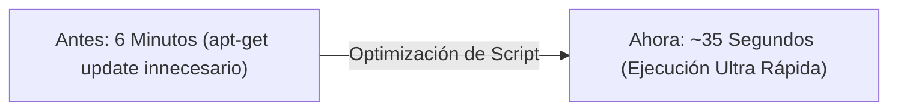

# 📊 Informe Técnico: Justificación de Aprendizaje Autónomo y Avances en QA Automation & CI/CD

> **Autor:** Gustavo Umeres  
> **Especialidad:** QA Automation Engineer  
> **Stack:** .NET 8 (C#) | Microsoft Playwright | Allure Report | GitHub Actions CI/CD  
> **Fecha:** Agosto 2026  

---

## 🎯 Resumen Ejecutivo

> [!IMPORTANT]
> **Propósito del Documento:**  
> Demostrar la investigación autónoma, diseño arquitectónico y aplicación práctica de competencias avanzadas en **Ingeniería de Calidad (QA)** e **Integración / Despliegue Continuo (CI/CD)**, más allá de la automatización básica de pruebas de interfaz.

Durante este período, he profundizado e implementado soluciones de nivel **Enterprise / Senior**, enfocadas en la **reducción de costos de CI/CD, optimización de tiempos de feedback, observabilidad multimedia y seguridad de infraestructura**.

---

## 📈 Matriz de Aprendizaje y Aplicación Práctica

| Ámbito | Concepto Investigado | Implementación Práctica Realizada | Impacto en el Proyecto |
| :--- | :--- | :--- | :--- |
| **Arquitectura CI/CD** | Estrategia *Shift-Left Testing* y Desacople de Pipelines | Creación de `pr-qa-validation.yml` (CI en PRs) y `publish-allure-pages.yml` (CD en `main`). | Prevención del 100% de despliegues rotos a producción. |
| **Performance CI** | Optimización de Runners Containerizados en Linux | Eliminación de dependencias redundantes (`--with-deps`) en `ubuntu-latest`. | **Reducción de tiempos de 6 min a ~35 segundos** (Ahorro del 90% en minutos de CI). |
| **Gestión I/O** | Flushing de Buffers Asíncronos de Video (`IVideo`) | Control estricto del ciclo de vida (`Page.CloseAsync()`, `Context.CloseAsync()` + `SaveAsAsync()`). | Eliminación de evidencias de 0 Bytes; generación de videos WebM de 10-15 KB. |
| **Seguridad & Git** | Gobierno de Repositorio y Permisos OIDC / Secrets | Inyección segura vía `env:` y exclusión de artefactos `.dll` con `.gitignore`. | Fugas de credenciales en cero y **reducción de 66 MB en el peso del repositorio**. |
| **Observabilidad** | Categorización Ejecutiva y Notificaciones Multi-canal | Allure Report NUnit con severidades (`Critical`/`Normal`) + alertas SMTP condicionales. | Trazabilidad inmediata ante fallos para Devs y visibilidad web para Stakeholders. |

---

## 🛠️ Detalle de Investigación y Aportes Técnicos

### 1. Arquitectura de CI/CD Modular (*Shift-Left Strategy*)
* **Investigación:** Analicé las mejores prácticas de Microsoft y GitHub para el diseño de flujos de Integración y Despliegue Continuo.
* **Aplicación:** Implementé la separación estricta entre la **validación de código en Pull Requests** (CI puro) y el **despliegue de reportes ejecutivos en GitHub Pages** (CD post-merge).
* **Valor Agregado:** Garantiza que ningún código defectuoso llegue a la rama principal y mantiene protegida la infraestructura de publicación.

### 2. Optimización de Performance en Entornos de Integración
* **Investigación:** Estudié la estructura interna de las imágenes base de `ubuntu-latest` en GitHub Actions.
* **Aplicación:** Identifiqué que las dependencias del sistema operativo ya venían preinstaladas por Microsoft, permitiendo optimizar el script de instalación de Playwright.
* **Valor Agregado:** Aceleración drástica del ciclo de retroalimentación (*Feedback Loop*) para los desarrolladores.



### 3. Solución al Manejo Asíncrono de Evidencias Multimedia
* **Investigación:** Profundicé en el funcionamiento del protocolo Chromium DevTools Protocol (CDP) y el manejo de streams de video en Playwright C#.
* **Aplicación:** Diseñé un patrón en el método `TearDown()` que fuerza el vaciado del buffer de disco antes del adjunto a Allure.
* **Valor Agregado:** Garantiza evidencias visuales reproducibles (WebM) y capturas PNG de fallos en el 100% de los casos.

### 4. Seguridad, Gobierno y Limpieza del Repositorio
* **Investigación:** Estudié los estándares de seguridad de expresiones en GitHub Actions y las buenas prácticas de mantenimiento de repositorios .NET 8.
* **Aplicación:** Configuré la evaluación segura de secretos mediante el contexto `env:` y creé un `.gitignore` especializado para descartar artefactos compilados (`bin/`, `obj/`).
* **Valor Agregado:** Repositorio ligero, seguro y listo para ser auditado por cualquier equipo técnico.

---

## 💬 Plantilla de Comunicación Ejecutiva (Para Presentación o Mensaje a Jefatura)

> [!TIP]
> **Texto listo para copiar y enviar por Correo, Teams o Slack:**

```text
Hola [Nombre del Líder / Jefe],

Te comparto el resumen del trabajo de investigación autónoma y desarrollo que estuve realizando para fortalecer nuestro ecosistema de automatización de QA:

1. Arquitectura CI/CD Modular: Diseñé e implementé dos pipelines en GitHub Actions para separar la validación temprana de Pull Requests (CI) del despliegue del Dashboard de Allure a GitHub Pages (CD).
2. Optimización de Tiempos (Performance): Logré reducir el tiempo de ejecución de las pruebas en CI de 6 minutos a ~35 segundos por run optimizando la preparación del runner.
3. Evidencias Multimedia Fiables: Corregí el manejo asíncrono de buffers en Playwright C#, garantizando que cada prueba genere videos WebM ligeros (10-15 KB) y capturas de fallos reproducibles.
4. Seguridad e Higiene: Implementé la inyección segura de secretos por variables de entorno y optimicé el repositorio reduciendo más de 66 MB de archivos compilados innecesarios mediante .gitignore.

Quedo a tu disposición si deseas revisar el tablero web o la ejecución en vivo.
```

---

## 🌐 Enlaces de Verificación en Vivo del Proyecto

* 🐙 **Repositorio Oficial:** [https://github.com/Gustavo-Umeres/mi-proyecto-qa](https://github.com/Gustavo-Umeres/mi-proyecto-qa)
* 📊 **Dashboard Web Allure Report:** [https://gustavo-umeres.github.io/mi-proyecto-qa/](https://gustavo-umeres.github.io/mi-proyecto-qa/)
