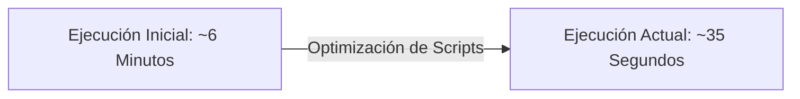

# 🚀 Resumen Técnico y Arquitectura de Automatización QA

> **Proyecto:** Net8PlaywrightQA  
> **Stack:** .NET 8 (C#) | Microsoft Playwright | Allure Report | GitHub Actions CI/CD  
> **Entorno:** Enterprise Production Standard  

---

## 📋 1. Ficha Técnica y Tecnologías

| Componente | Tecnología | Versión | Rol en la Arquitectura |
| :--- | :--- | :--- | :--- |
| **Runtime & Lenguaje** | .NET 8 SDK (C#) | `8.0.x` | Entorno de ejecución de alto rendimiento fuertemente tipado. |
| **Motor de Automatización** | Microsoft Playwright C# | `1.45.0` | Control de navegadores sin interfaz, auto-esperas y grabación multimedia. |
| **Framework de Pruebas** | NUnit | `4.1.0` | Runner de pruebas y control del ciclo de vida (`SetUp`/`TearDown`). |
| **Reporting Ejecutivo** | Allure NUnit + CLI | `2.12.1` | Dashboard HTML interactivo con métricas, severidades y evidencias. |
| **Integración Continua (CI)** | GitHub Actions (`pr-qa-validation.yml`) | v4 | Validar Pull Requests en paralelo (Chromium + Firefox) en ~35s. |
| **Despliegue Continuo (CD)** | GitHub Actions (`publish-allure-pages.yml`) | v4 | Publicar automáticamente el reporte web en GitHub Pages tras el merge. |
| **Notificaciones** | SMTP Email (`action-send-mail`) | v3 | Alertas automáticas por correo electrónico al finalizar las pruebas. |

---

## 🛠️ 2. Resumen de Implementación Técnica

### A. Arquitectura CI/CD Desacoplada (Shift-Left Strategy)
El proyecto implementa una separación entre el pipeline de **Integración Continua (CI)** y el pipeline de **Despliegue Continuo (CD)**:

```mermaid
graph TD
    subgraph "CI: Validación de PRs (pr-qa-validation.yml)"
        A["Pull Request a main/develop"] --> B["Compilar .NET 8"]
        B --> C["Matriz Paralela: Chromium & Firefox"]
        C --> D["Ejecutar Tests & Generar Allure HTML"]
        D --> E["Subir Artefactos ZIP (Videos + TRX)"]
        E --> F["Notificar por Correo SMTP (Opcional)"]
    end

    subgraph "CD: Publicación Web (publish-allure-pages.yml)"
        G["Push a main (Post-Merge)"] --> H["Ejecutar Suite de Regresión"]
        H --> I["Generar Allure HTML Oficial"]
        I --> J["Desplegar a GitHub Pages (Web Pública)"]
    end
```

### B. Optimización de Performance en Runners Linux
Se optimizó la preparación de navegadores en GitHub Actions (`ubuntu-latest`), omitiendo paquetes innecesarios del sistema operativo (`--with-deps`).

### C. Captura Asíncrona de Evidencias Multimedia
Se implementó un patrón en el método `TearDown()` de NUnit para asegurar el vaciado del buffer de disco de Chromium antes del adjunto en Allure Report:

* **Ciclo de vida:** `Page.CloseAsync()` y `Context.CloseAsync()` antes de invocar `video.SaveAsAsync(path)`.
* **Resultado:** Generación de videos WebM de **10 KB a 15 KB** y capturas PNG de fallos garantizados sin archivos de 0 Bytes.

### D. Seguridad y Gobierno de Código
* **Variables de Entorno y Secretos:** Mapeo de credenciales de API y SMTP mediante contextos `env:` seguros.
* **Mantenimiento del Repositorio:** Exclusión de carpetas de compilación (`bin/`, `obj/`, `allure-results/`, `evidencias/`) mediante `.gitignore` activo, optimizando el clonado en Git.

---

## 📊 3. Matriz de Componentes y Cobertura

| Módulo / Prueba | Tipo | Descripción de Cobertura | Severidad |
| :--- | :--- | :--- | :--- |
| `TC01_LoginExitoso` | E2E UI | Validación de autenticación correcta y redirección a catálogo. | `Critical` |
| `TC02_LoginInvalido` | E2E UI | Verificación de mensajes de error ante credenciales incorrectas. | `Normal` |
| `TC03_ValidarVisibilidadDelLogo` | E2E UI | Comprobación de renderizado visual de la marca en la cabecera. | `Minor` |
| `API01_ConsultarProductos` | Integration API | Verificación de estado HTTP 200 OK y estructura de payload. | `Critical` |

---

## 🌐 Enlaces Oficiales del Proyecto

* 🐙 **Repositorio GitHub:** [https://github.com/Gustavo-Umeres/mi-proyecto-qa](https://github.com/Gustavo-Umeres/mi-proyecto-qa)
* 📊 **Dashboard Web Allure Pages:** [https://gustavo-umeres.github.io/mi-proyecto-qa/](https://gustavo-umeres.github.io/mi-proyecto-qa/)
